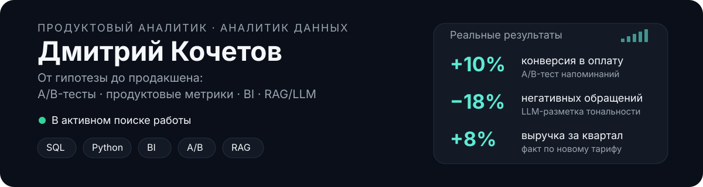

  

## Ключевые кейсы

Развёрнутые версии — с контекстом, гипотезой и ходом решения — в [CASES.md](CASES.md).

| Задача | Результат |     |
| --- | --- | --- |
| A/B-тест напоминаний о долге: сегментировал должников по глубине просрочки и поведению, гипотеза — часть просто забывчивы | Конверсия в оплату **+10%**, легло в основу запуска продукта | [подробнее →](CASES.md#case-1) |
| ABCD-тест новых страниц каталога поставщика | Конверсия в оплату **+6%**, путь до оплаты короче на 2 дня — раскатили на всю аудиторию | [подробнее →](CASES.md#case-2) |
| RFM-сегментация базы + точечные коммуникации по сегменту «на грани оттока» | Отток **−4,5%** | [подробнее →](CASES.md#case-3) |
| LLM-разметка тональности и тем обращений клиентов, топ-3 проблемы вынесены в разработку | Доля негативных обращений **−18%** | [подробнее →](CASES.md#case-4) |
| Финмодель нового тарифа на статистике оплат за 2 года | Прогноз **+10%** выручки за квартал, факт — **+8%** | [подробнее →](CASES.md#case-5) |
| Локальная RAG-система по базе знаний компании: Confluence → эмбеддинги → LLM с ссылками на источники | Быстрее онбординг и поиск информации внутри команды | [подробнее →](CASES.md#case-6) |
| Карта поставщиков по регионам + ML-прогноз потенциала подключений | Выявлены регионы с потенциалом прироста прибыли на **15–20%** | [подробнее →](CASES.md#case-7) |

---

## Обо мне

Прохожу путь от гипотезы до продакшена: A/B-тесты, сегментация, юнит-экономика, дерево продуктовых метрик, BI-дашборды. В последний год добавил к этому прикладной AI — собираю RAG-системы и LLM-инструменты, которые автоматизируют рутину аналитика и продуктовой команды.

Работал на стыке банковской аналитики (Power BI/DAX, KPI в реальном времени), продуктовой аналитики B2B-платформы (A/B-тесты, RFM, когорты, финмодели тарифов) и финтеха (юнит-экономика, geo-аналитика, ML-прогноз потенциала).

---

## Стек

**[Данные](#проекты):** Python (pandas, numpy, scikit-learn, statsmodels) · SQL

**[BI / визуализация](#проекты):** Power BI (DAX, Power Query) · Grafana · Redash · DataLens · matplotlib · plotly

**[Методы](#проекты):** A/B-тесты · RFM-сегментация · когортный анализ · кластеризация (k-means) · юнит-экономика · финмоделирование

**AI / LLM:** [RAG-системы](https://github.com/konicaRu/a3_product_759_RAG_public) · промпт-инжиниринг · применение LLM в NLP-задачах (тональность, детект паттернов в тексте)

---

## Проекты

| Проект | Описание | Стек | Ссылка |
| --- | --- | --- | --- |
| **F1 Predict** | Закрытая лига прогнозов на гонки Формулы-1: расчёт очков, автоматизация через CI/CD, уведомления в Telegram | React · Supabase (Postgres, Auth, RLS) · GitHub Actions | [репозиторий](https://github.com/konicaRu/f1-predict) |
| **Local RAG Pipeline** | RAG-система для поиска по внутренней технической документации: двухэтапный скоринг (embeddings + LLM-оценка), реранкер, память диалога — полностью локально, ни одного внешнего API-вызова. В проде на реальной базе — ~1300 документов, ответ за 5–20 сек. Анонимизированная демо-версия рабочего проекта, с разбором архитектуры для Хабра | Python · FastAPI · bge-m3 · Qwen2.5 · llama-cpp-python | [репозиторий](https://github.com/konicaRu/a3_product_759_RAG_public) |
| **A3 PDF Markdown** | Desktop-приложение для batch-конвертации PDF/DOCX/PPTX/XLSX в Markdown с OCR и точечным vision-fallback для графиков и схем | Python · PySide6 · PyMuPDF · EasyOCR | [репозиторий](https://github.com/konicaRu/a3_pdf_markdown) |
| **HH Vacancy Tracker** | Инструмент сбора и фильтрации вакансий с hh.ru с ручным review, покрыт тестами | Python · Streamlit · pytest | [репозиторий](https://github.com/konicaRu/hh_api_vacany) |
| **Editable Mind Map** | Редактируемая радиальная mind-map: drag/zoom/pan, фильтры по тегам, сохранение в localStorage/JSON, без сборки | Vanilla JS (ES-модули) | [репозиторий](https://github.com/konicaRu/mindmap) |

<b>Ранние проекты — Яндекс.Практикум</b> (Excel, Python, SQL, Tableau, ML — период обучения)

 

| №   | Проект | Что сделано | Навыки |
| --- | --- | --- | --- |
| 1   | [Рынок недвижимости Петербурга](https://nbviewer.jupyter.org/github/konicaRu/i_am_data_analyst/blob/master/2_project_research_data_analysis/2_project_flat_for_sale.ipynb) | Определил, какие параметры сильнее всего влияют на цену квартиры — для автоматической системы оценки | Python, Pandas, Matplotlib, EDA |
| 2   | [Тарифы телеком-оператора](https://nbviewer.jupyter.org/github/konicaRu/data_analyst/blob/master/3_project_statistical_analysis_data/3_project_telecom_tariff.ipynb) | Проверил статистическую разницу в выручке между тарифами, дал рекомендации отделу маркетинга | Python, Pandas, SciPy, проверка гипотез |
| 3   | [Продажи компьютерных игр, 1992–2016](https://nbviewer.jupyter.org/github/konicaRu/i_am_data_analyst/blob/master/4_complete_project_1/complete_project_1_computer%20games.ipynb) | Исследовал рынок игр для планирования рекламных кампаний и закупок | Python, Pandas, NumPy, EDA |
| 4   | [Юнит-экономика Яндекс.Афиши](https://nbviewer.jupyter.org/github/konicaRu/i_am_data_analyst/blob/master/6_project_analytics_in_yandex_afisha_3send/6_project%20_analytics_in_yandex_afisha_3send.ipynb) | Когортный анализ окупаемости клиентов — нашёл, где теряется конверсия на мобильных устройствах | Python, когортный анализ, юнит-экономика |
| 5   | [Приоритизация гипотез + A/B-тест](https://nbviewer.jupyter.org/github/konicaRu/i_am_data_analyst/blob/master/7_project_a_b_test_2_send/7_project%20_a_b_test_2_send.ipynb) | ICE/RICE-приоритизация гипотез роста выручки и анализ результатов A/B-теста интернет-магазина | Python, SciPy, A/B-тестирование |
| 6   | [Рынок общепита Москвы](https://nbviewer.jupyter.org/github/konicaRu/i_am_data_analyst/blob/master/8_project_public_catering_msk/8_project%20_public_catering_1send.ipynb) | Оценил перспективность формата кафе с роботами-официантами для презентации инвесторам | Python, Pandas, Plotly, Seaborn |
| 7   | [Воронка продаж в мобильном приложении](https://nbviewer.jupyter.org/github/konicaRu/i_am_data_analyst/blob/master/9_project_ab_test/9_together_in_git_ab_test.ipynb) | A/A/B-тест и анализ воронки продуктового стартапа: конверсия в оплату 47% | Python, событийная аналитика, A/B-тестирование |
| 8   | [Дашборд для Яндекс.Дзена](https://public.tableau.com/profile/dim6669#!/vizhome/10_project_ya_practik/Dashboard1) | Интерактивный дашборд по взаимодействиям с карточками статей с сортировкой по темам, времени, возрасту аудитории | Tableau, PostgreSQL, SQLAlchemy |
| 9   | [Отток клиентов фитнес-клуба (ML)](https://nbviewer.jupyter.org/github/konicaRu/i_am_data_analyst/blob/master/11_project_ML_fitness_club/11_ML_project_1_send.ipynb) | Прогноз вероятности оттока и кластеризация клиентских портретов | Python, scikit-learn, классификация, кластеризация |

Весь список с разбором — в [i_am_data_analyst](https://github.com/konicaRu/i_am_data_analyst).

- [my_learning_tracker](https://github.com/konicaRu/my_learning_tracker) — трекер пройденных курсов
- [data_structures_and_algorithms](https://github.com/konicaRu/data_structures_and_algorithms) — задачи по алгоритмам и структурам данных
- [Блог](https://konicaru.github.io) — заметки о процессе обучения

---

## Контакты

📧 [dimkochetow@gmail.com](mailto:dimkochetow@gmail.com) · 💬 [Telegram](https://t.me/konica_f1) · 💼 [LinkedIn](https://www.linkedin.com/in/dimkochetov/)
